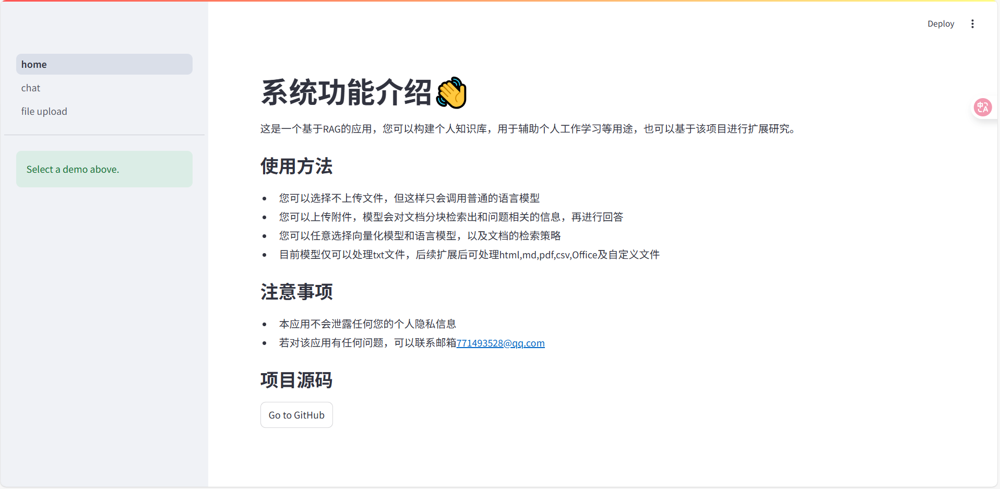
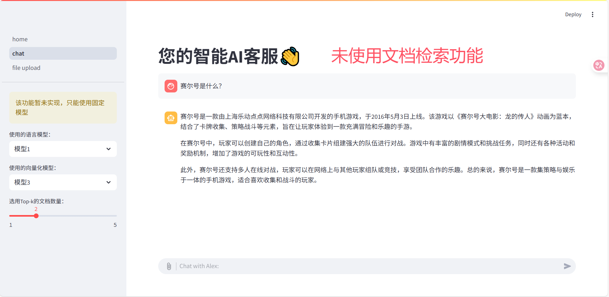
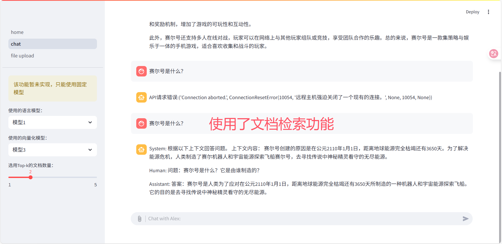
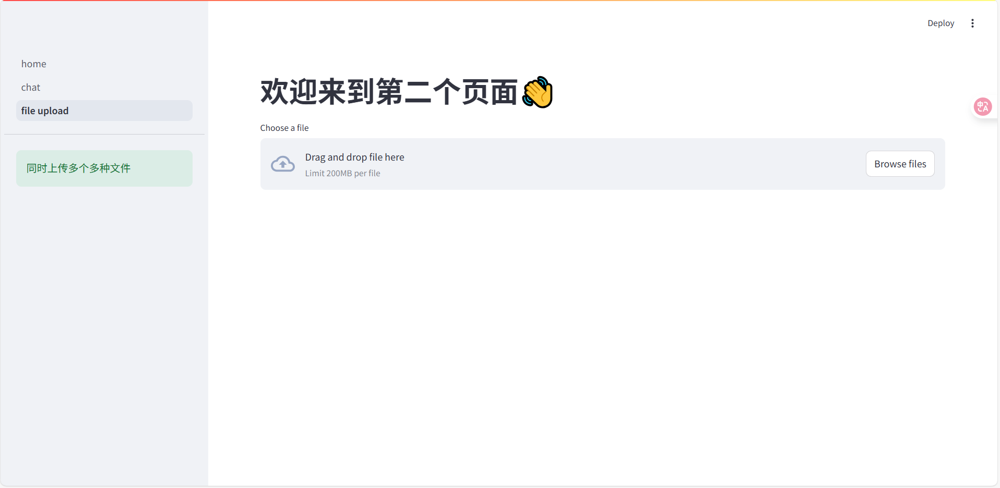

## 基于RAG的个人知识库

#### Result









#### 1 项目介绍

目前RAG应用在企业中应用非常广泛，可以有效地解决模型幻觉问题，若将RAG用于个人工作学习，也会有不错的效果。

该项目是标准的前后端分离应用，所有接口均符合RESTful API规范。前端使用streamlit库构建，后端使用FastAPI框架构建，前端使用requests库进行请求。你也可以将该项目嵌入到如Springboot项目中，提供额外的功能。

我对项目结构进行了多次重构，保证了项目的代码清晰易懂，并将所有代码按照功能模块全部封装到了方法里，这样在后续进行扩展时，只需要修改对应的方法即可。

#### 2 项目部署

##### 2.1 环境准备

使用该命令创建环境

```pip install requirements.txt -r```

建议python>=3.10，因为我在项目中用到了新的语法规范。

##### 2.2 模型准备

你需要先下载预训练模型，才可以使用该应用，从Hugging Face上下载Qwen/Qwen2.5-1.5B-Instruct模型和sentence-transformers/all-mpnet-base-v2模型，并在文件中修改模型地址为你本地的模型地址即可。

##### 2.3 启动

启动后端：在backend文件夹里启动main.py文件即可。

启动前端：在frontend文件夹里使用以下命令```streamlit run home.py```

#### 3 改进方法

##### 3.1 模型改进方法

该项目中使用的语言模型只有1.5B，你可以选择参数更大的模型以增强生成效果，并选择合适的量化和推理加速方法，以进一步增强模型性能。当然你也可以选择你自己开发的模型作为语言模型，只需要在对应的方法里修改接口即可。

同理，你可以按照同样的策略选择合适的向量化模型。

##### 3.2 文档检索策略改进方法

我目前的分块策略是按照段落分块，检索出语义相似度最高的块，作为上下文传递给语言模型。但是你可以选择全新的分块策略。

同样的，在检索文档时，我只按照语义相似度检索出了第一个块，但是你可以选择全新的检索策略，例如为检索结果添加相似性评分、结合多个检索器的结果、使用混合向量和关键词检索等策略。

#### 4 附录

该项目参考了官方文档的案例，但做了一些修改，您可以基于该项目进行学习和扩展，若您进行二次开发，请标明参考源。
该项目由我个人维护，后续若扩展也会同步至该仓库，若有任何异议请联系该邮箱：771493528@qq.com

